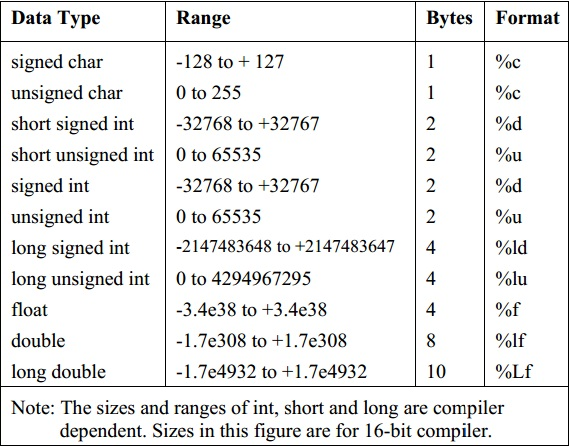

# Data type range

[Check out the video explain `int` type in detail](https://www.youtube.com/watch?v=zxb8DvLUqcM)

## Data types in C

## Signed vs un-signed

For signed data type, the left most one bit is reserved for sign either + or -. Whereas for un-signed data type none of bit is reserved for represent + or -. For example:

1 byte = 8 bits, in the context of 8 bits or 1 byte:

For signed data type, the leftmost 1 bit is used for + or -. Where 0 means + positive number and 1 means - negative number. So at the end we have left with only 7 bits to store the actual value. This effects the range (min, max) value that we can store in 7 bits; i.e 2^7^ = -128 to +127

Whereas in case un-signed data type, we have all 8 bits available to store the actual value. So we can have larger range which is 2^8^ = 0 to 255

### 2^7^ = 128 so why max value is +127 and min is -128

This is because we have value 0 too to be consider. 2^7^ = 128 which includes values from 1 to 128. We can only store maximun of 128, so if we include 0 then range will be 0 to 127. Now for negative zero, we do not need to have separate binary representation. 0 and -0 represent in same binary numbers distinguished by only the left most bit either 0 (+) or 1 (-). Therefore for negative range in we do not consider 0 again so we end up with range -1 to -128.

Similarly, 2^8^ = 256 and range is 0 to 255, because to accomodate 0 the maximum value reduced to 1. See in un-signed data type we do not consider negative range only positive range of mininum and maximum value.

## How range is calculated

> What is the mininum and maximum value that data type can store.

If you provide value to data type out of its range then you get error or unexpected result.

1 byte = 8 bits. That we all know right.

General farmula to calculate range is `2^(number of bits) - 1`. -1 to include 0 in the range.

So for 8 bits, 2^8^ = 256 and range will be 0 to 255.

### Signed data type

n = total number of bits

* Min value = -(2^n-1^)
* Max value = (2^n-1^) - 1

### Un-signed data type

n = total number of bits

* Min value = 0
* Max value = (2^n-1^) + (2^n-1^ - 1)
