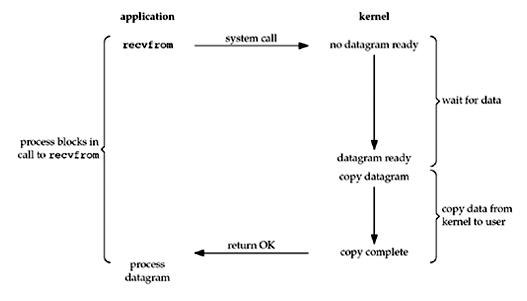
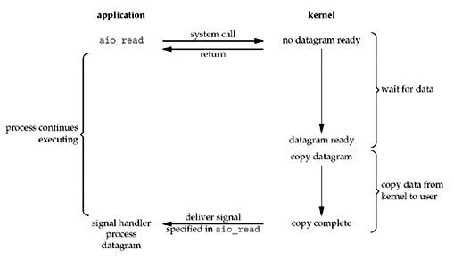

# The Various Kinds of IO - Blocking, Non-blocking, Multiplexed and Async

## In hardware context

On modern operating systems, IO, for input/output, is a way for data to be exchanged with peripherals. This includes reading or writing to disk, or SSD, sending or receiving data over the network, displaying data to the monitor, receiving keyboard and mouse input, etc.

The ways in which modern operating systems communicate with peripherals depends on the specific type of peripherals and their firmware and hardware capabilities. In general, the peripherals are quite advanced, and they can handle **multiple concurrent requests** to write or read data. That is, gone are the days of serial communication.

> In that sense, all communications between the CPU and peripherals is therefore asynchronous at a hardware level.

This asynchronous mechanism is called **hardware interrupt**. Think of the simple case, where the CPU would ask the peripheral to read something, and it would then go in an infinite loop, where each time it would check with the peripheral if the data is now available for it to consume, looping until the peripheral gives it the data. This method is known as **polling**, since the CPU needs to keep checking on the peripheral.

On modern hardware, what happens instead is that the CPU asks the peripheral to perform an action, and then forgets about it, continuing to process other CPU instructions. Once the peripheral is done, it will signal the CPU through a circuit interrupt. This happens in hardware, and makes it so the CPU never waits or checks on the peripheral, thus freeing it to perform other work, until the peripheral itself says it's done.

## In software context

So as we know modern I/O at the harware level has capability to perform action asynchronously. And at the software level along with system API provided by kernel, we can implement the interaction with I/O in various ways either synchronously or asynchronously as describe below.

> The implementation is done by system calls (System API) such as `epoll` in linux, `kqueue` in mac. These are the API provided by OS kernel to be used to implement I/O interaction model for your application. For example: node.js uses `libuv` library which implements the asynchronous I/O interaction model in order to keep main thread unblocked during I/O operations.

In models below, in a diagram, there are normally two distinct phases for an input operation:

1. Waiting for the data to be ready. This involves waiting for data to arrive on the network. When the packet arrives, it is copied into a buffer within the kernel.
2. Copying the data from the kernel to the process. This means copying the (ready) data from the kernel's buffer into our application buffer

**recvfrom** - Refer as system call in diagrams below, which uses `epoll` or other system API for I/O.

### Blocking I/O

> Synchronously.

Remember how a user program runs inside a process, and code is executed within the context of a thread? This is always the case, and thus say you are writing a program that needs to read from a file. With blocking IO, what you do is ask the operating system, from your thread, to put your thread to sleep, and wake it up only once the data from the file is available to be consumed by your thread.

That is, blocking IO is called blocking because the thread which uses it will block and sleep until the IO is done.

### Nonblocking I/O

> Synchronously.

The idea is that when you make the call to read the file, instead of putting your thread to sleep, the OS simply returns to you pending status `EWOULDBLOCK` that tells you the IO is not done. It will not block your thread, but it's still your job to check back at a later time to see if the I/O is done. As diagram above, for the first three `recvfrom`, there is no data to return and the kernel immediately returns an status of `EWOULDBLOCK`. For the fourth time we call `recvfrom`, a datagram is ready, it is copied into our application buffer, and `recvfrom` returns successfully. We then process the data.

When an application sits in a loop calling `recvfrom` in regular intervals like this, it is called **polling**. The application is continually polling the kernel to see if some operation is ready. This is often a waste of CPU time in checking when your recieve nothing.

### Multiplexing I/O

> Synchronously.

Polling over a set of file descriptors.

I/O multiplexing is the capability to tell the kernel that we want to be notified if one or more I/O conditions are ready, like input is ready to be read, or descriptor is capable of taking more output.
It is used when client is handling multiple descriptors (like standard input and network socket), when client handles multiple sockets at the same time, example - Web client. The advantage is, we can wait for more than one descriptor to be ready.

### Asynchronous I/O

> Asynchronously - Using modern hardware asynchronous capabilities built in circuit to implement asynchronous interaction.

This works by telling the kernel to start the operation and to notify us when the entire operation (including the copy of the data from the kernel to our buffer) is complete. This system call returns immediately and our process is not blocked while waiting for the I/O to complete.

This is done through event callbacks. The call to perform a read takes a callback, and returns immediately. On the IO completing, the OS will suspend your thread, and execute your callback. Once the callback is done executing, it will resume your thread.

> I/O models (blocking, nonblocking, I/O multiplexing) are all synchronous because the actual I/O operation (recvfrom) blocks the thread. Only the asynchronous I/O model matches the asynchronous I/O definition.
