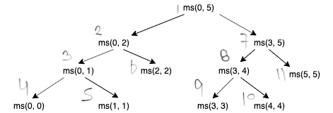

# Divide and conquer

A typical Divide and Conquer algorithm solves a problem using following three steps.

1. **Divide:** Break the given problem into subproblems of **same type**. This step generally takes a recursive approach to divide the problem until base case is reached or no sub-problem is further divisible.
2. **Conquer (solve):** Recursively solve these subproblems.
3. **Combine:** When the smaller sub-problems are solved, this stage recursively combines them until they formulate a solution of the original problem.

!!! example
    - Merge sort
    - Quick sort
    - Binary search

## Merge sort example

Lets know the base case, divide, conquer (solve) and combine cases.

- **Base case:** Array with one element (array size = 1 => n = 1) because one element array is already sorted.
- **Divide** the array into 2 halves until hit the base case.
- Once we have collection of array having one element. Take 2 arrays, compare the elements of both array and place the elements in desired order (increasing or decreasing). This whole process can be seen as **conquer + combine** steps of divide and conquer appraoch. Do comparing and merging until you have one array left having all the elements.

### Recurrence relation

$$ T(n) = \begin{cases} 1 & n = 1 \\ 2 \times T(\frac{n}{2}) + n & n > 1 \end{cases} $$

- The base case occurs when n = 1.
- When n > 1, time for merge sort.

### Pseudocode

```
//A->array, l->left most index, r->right most index
MERGE-SORT(A, l, r)
    If r > l
      mid = (l+r)/2
      MERGE-SORT(A, l, mid)
      MERGE-SORT (A, mid+1, r)
      MERGE(A, l, mid ,r)
```

### Recursive call tree representation

We have array: **9, 6, 5 , 0, 8, 2**. Lets draw a tree representing recursive calls.

> ms(0, 5) is a merge sort function having parameters, left most index and right most index. The change in the value of left most index and right most index is shown in tree below as we divide the problem in subproblems until hit the base case.


