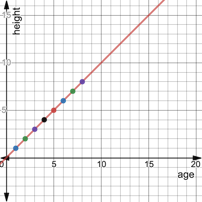

# Function

A function relates an input to an output.

> We can draw a line on a "coordinate plane" (xy graph). Where x is a input and y is output of the function. This way we can visualize the behvior of the function when provided with bunch of different input values. **Line on coordinate plane tells us about the relationship between input and output.**

## Name

First, it is useful to give a function a name. The most common name is "f", but we can have other names like "g", "h", anything.

> f of x equals x squared.

!!! example
    $f(x) = x^2$. Function "f" takes "x" and squares it.

    - f(2) = 4
    - f(4) = 16

### x is just a placeholder

It is just there to show us where the input goes and what happens to it.

!!! example
    $f(x) = 1 - x + x^2$

    Say x = 2 then:

    $f(2) = 1 - 2 + 2^2 = 3$

## Input, relationship and output

There are always three main parts.

We have funciton $f(x) = x \times 2$ then:

| Input | Relationship        | output |
|-------|---------------------|--------|
| 2     | x 2 (mutliply by 2) | 4      |
| 4     | x 2 (mutliply by 2) | 8      |

## Relation

The tree grows 1 inch every year, so the height of the tree is related to the age of the tree. So we can write it in function as `h(age) = age x 1`, So, if the age of tree is 10 years, the height is `h(10) = 10 × 1 = 10 inch`

Lets draw it on coordinate plane to visualize the behavior.

h(age) = age x 1

| Input (age) | Output (height) |
|-------------|-----------------|
| 1           | 1               |
| 2           | 2               |
| 3           | 3               |
| 4           | 4               |
| 5           | 5               |
| 6           | 6               |
| 7           | 7               |
| 8           | 8               |

!!! info "What does graph tell us about the relation?"
    Input and output has linear relationship.

    > A function whose graph forms a straight line is called a linear function.

    Function h(age) = age x 1 form a striaght line.

    It means the height of tree grows at the same rate as age. The growth rate is same as age.

Depend upon the function we have a many function relation such as quadratic function, cubic function, exponential function and so on.

## Function rules

1. Every element in X is related to Y.
2. No element in X has two or more relationships. It will not give back 2 or more results for the same input. "One-to-many" is not allowed, but "many-to-one" is allowed.

## Composition of function

A composite function is a function that depends on another function. A composite function is created when one function is substituted into another function.

> (f º g)(x) =  f(g(x)) is read as “f of g of x”.

[Function composition video](https://www.youtube.com/watch?v=Clsaq_GytpA)
