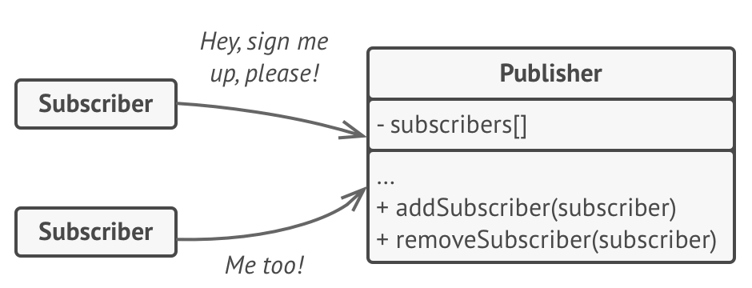

# Observer [Event-Subscriber, Listener]

It lets you **define a subscription mechanism to notify multiple objects about any events** that happen to the object they’re observing.

## Problem

Imagine that you have two types of objects: a  `Customer`  and a  `Store`. The customer is very interested in a particular brand of product (say, it’s a new model of the iPhone) which should become available in the store very soon.

The customer could visit the store every day and check product availability. But while the product is still en route, most of these trips would be pointless.

On the other hand, the store could send tons of emails (which might be considered spam) to all customers each time a new product becomes available. This would save some customers from endless trips to the store. At the same time, it’d upset other customers who aren’t interested in new products.

It looks like we’ve got a conflict. Either the customer wastes time checking product availability or the store wastes resources notifying the wrong customers.

## Solution

The object that has some interesting state is often called  _subject_, but since it’s also going to notify other objects about the changes to its state, we’ll call it  _publisher_. All other objects that want to track changes to the publisher’s state are called  _subscribers_.

The Observer pattern suggests that you add a subscription mechanism to the publisher class so individual objects can subscribe to or unsubscribe from a stream of events coming from that publisher. Fear not! Everything isn’t as complicated as it sounds. In reality, this mechanism consists of 1) an array field for storing a list of references to subscriber objects and 2) several public methods which allow adding subscribers to and removing them from that list.



Now, whenever an important event happens to the publisher, it goes over its subscribers and calls the specific notification method on their objects.

## Applicability

1. Use the Observer pattern when changes to the state of one object may require changing other objects, and the actual set of objects is unknown beforehand or changes dynamically.

2. Use the pattern when some objects in your app must observe others, but only for a limited time or in specific cases. The subscription list is dynamic, so subscribers can join or leave the list whenever they need to.

## Code

```js
/**
 * Subject
 */
function Click() {
  this.handlers = []; // observers
}

Click.prototype = {

  // add observer
  subscribe: function(fn) {
    this.handlers.push(fn);
  },

  // remove observer
  unsubscribe: function(fn) {
    this.handlers = this.handlers.filter(
      function(item) {
        if (item !== fn) {
          return item;
        }
      }
    );
  },

  // notify all observer. Notice that the fire method accepts two arguments.
  // The first one has details about the event and the second one is the context,
  // that is, the this value for when the eventhandlers are called.
  // If no context is provided this will be bound to the global object (window).
  fire: function(o, thisObj) {
    var scope = thisObj || window;
    this.handlers.forEach(function(item) {
      item.call(scope, o);
    });
  }
};

/**
 * 2. Client
 */
function run() {

  var clickHandler1 = function() {
    console.log("execute handler 1");
  };
  var clickHandler2 = function() {
    console.log("execute handler 2");
  };

  var click = new Click();

  click.subscribe(clickHandler1);
  click.subscribe(clickHandler2);
  click.fire('event');
}

/**
 * execute
 */
run();
```
