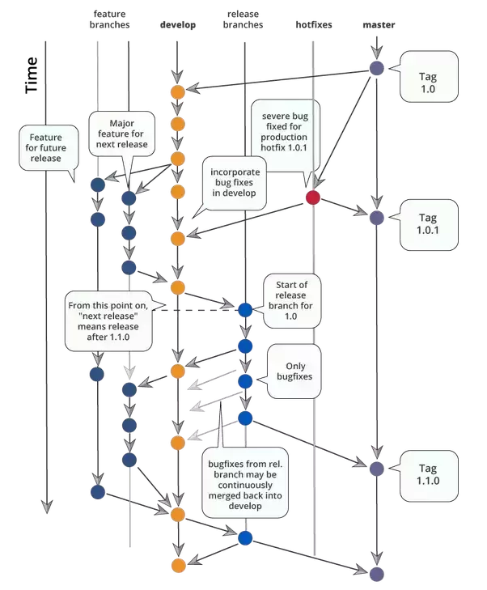

# Conventions

## Semantic versioning

Build process should use [semantic versioning](https://semver.org/).

### Branch types

- **master** (production) - `origin/master` to be the main branch where the source code is a production-ready state.
- **develop** code that is feature complete, but not in production. Consider `origin/develop` to be the main branch where the source code always reflects a state with the latest delivered development changes for the next release.
- **feature** branches is where most work will be completed. **Once complete, a pull request will be created.** Once a pull request is approved, it will be merged into the develop branch.
- **hotfix** branches are created when a bug that needs to go directly into master needs to be fixed. Once complete, these branches will be merged into the develop branch.
- **release** branches are created once all features have been merged and final QA testing has started.
- **bugfix** branches are created for bugs that need to be fixed. Usually bugs will be fixed with a feature, but in some cases bug branches will be created if it could affect a lot of other areas in the app.

!!! note "Workflow summary"
    1. A develop branch is created from master.
    2. A release branch is created from develop.
    3. Feature branches are created from develop.
    4. When a feature is complete, it is merged into the develop branch.
    5. When the release branch is done and QAed it is merged into develop and master.
    6. If an issue in master is detected a hotfix branch is created from master.
    7. Once the hotfix is complete it is merged to both develop and master.

!!! note "Branch naming"
    branchType(/ or -)[issueId|featureId]-shortDescription

    Example: feature/12345-autocomplete-search or feature-12345-autocomplete-search



## Commit message

### Guidelines

#### subject _[50 chars]_

This is a very short description of the change.

- use imperative, present tense. “fix” not “fixed or fixes”, “add” not “added”.
- capitalize first letter.
- add ticket number ahead of the commit if any. For example, `123456: Add a new button to the home screen`
- do not add dot(.) at the end of subject.

#### body _[72 chars]_

> Optional and separated by blank line.

In some cases you probably want to leave more clues in your commit message. For this purpose use message body. It typically goes after subject line and is divided from it by one empty line.

- Use natural language.
- includes motivation for the change and contrasts with previous behavior.

#### footer _[72 chars]_

> Optional and separated by blank line.

Footer is mostly ignored, but in some cases it can be useful to add up some meta information.

- You can use it to list the issues it closes in your issue tracker.

```
Fixes: #123, #245, #992
Closes: #123, #245, #992
```

- All breaking changes have to be mentioned in footer with the description of the change, justification and migration notes.

```
BREAKING CHANGE: isolate scope bindings definition has changed
and the inject option for the directive controller injection was removed.

To migrate the code follow the example below:

Before:

scope: {
  myAttr: 'attribute',
  myBind: 'bind',
  myExpression: 'expression',
  myEval: 'evaluate',
  myAccessor: 'accessor'
}

After:

scope: {
  myAttr: '@',
  myBind: '@',
  myExpression: '&',
}
```

## Reusing branch which is already merged

> Do not reopen the branch which is already merged. Always create new one.

If you have merged `feature/1234-search` branch and later want to make a few changes to the branch, not bug fix, just a basic changes, then you should create a new branch from `develop` and name it say `feature/1234-search-few-tweaks` and make the changes and once done merge it to `develop`.

## Merge and rebase

### Merge commits

- Will keep all commits history of the feature branch and move them into the master branch
- Will add extra dummy commit.

### Rebase and merge

- Will append all commits history of the feature branch in the front of the master branch
- Will NOT add extra dummy commit.

### Squash and merge

- Will group all feature branch commits into one commit then append it in the front of the master branch
- Will add extra dummy commit.
