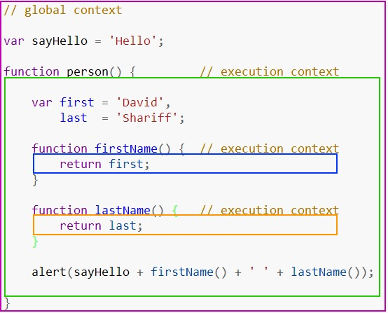
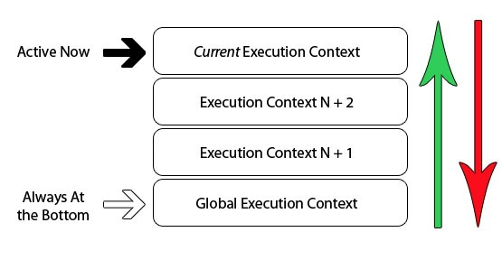
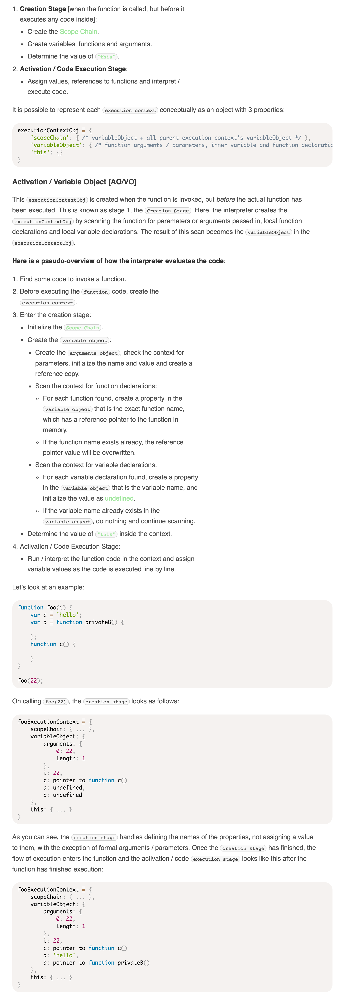

# Execution context

When code run in JavaScript, the environment in which it is executed is very important, and is evaluated as one of the following:

* **Global code** – The default envionment where your code is executed for the first time.
* **Function code** – Whenever the flow of execution enters a function body.
* **Eval code** – Text to be executed inside the internal eval function.

You can read a lot of resources online that refer to `scope`, and for the purpose of this article to make things easier to understand, let’s think of the term `execution context` as the envionment / scope the current code is being evaluated in. Now, enough talking, let’s see an example that includes both `global`and `function / local` context evaluated code.



Nothing special is going on here, we have one `global context` represented by the purple border and three different `function contexts` represented by the green, blue and orange borders. There can only ever be one `global context`, which can be accessed from any other context in your program.

You can have any number of `function contexts`, and each function call creates a new context, which creates a private scope where anything declared inside of the function can not be directly accessed from outside the current function scope. In the example above, a function can access a variable declared outside of its current context, but an outside context can not access the variables / functions declared inside.

## Execution Stack

The JavaScript interpreter in a browser is implemented as a single thread. What this actually means is that only one thing can ever happen at one time in the browser, with other actions or events being queued in what is called the `Execution Stack`. The diagram below is an abstract view of a single threaded stack:



As we already know, when a browser first loads your script, it enters the `global execution context` by default. If, in your global code you call a function, the sequence flow of your program enters the function being called, creating a new `execution context` and pushing that context to the top of the `execution stack`.

If you call another function inside this current function, the same thing happens. The execution flow of code enters the inner function, which creates a new `execution context` that is pushed to the top of the existing stack. The browser will always execute the current `execution context` that sits on top of the stack, and once the function completes executing the current `execution context`, it will be popped off the top of the stack, returning control to the context below in the current stack.

**There are 5 key points to remember about the execution stack**:

* Single threaded.
* Synchronous execution.
* One global context.
* Infinite function contexts.
* Each function call creates a new `execution context`, even a call to itself.

## Execution Context

So we now know that everytime a function is called, a new `execution context` is created. However, inside the JavaScript interpreter, every call to an `execution context` has 2 stages:

**During creation stage keep in mind the order in which activation object is created.**

> 1. Scan argument object.
> 2. Scan function declaration not function expression. If function name already exists then override.
> 3. Scan variable declaration (remember the variable with `var` keyword) and assign `undefined` value. If variable name already exists then bypass it.
> 4. Detrmine `this` value.



## A Word On Hoisting

You can find many resources online defining the term `hoisting` in JavaScript, explaining that variable and function declarations are _hoisted_ to the top of their function scope. However, none explain in detail why this happens, and armed with your new knowledge about how the interpreter creates the `activation object`, it is easy to see why. Take the following code example:

```js
(function() {

    console.log(typeof foo); // function pointer
    console.log(typeof bar); // undefined
    console.log(x); // reference error

    var foo = 'hello',
        bar = function() {
            return 'world';
        };

    x = 1;

    function foo() {
        return 'hello';
    }

}());
```

The questions we can now answer are:

### Why can we access foo before we have declared it?

If we follow the `creation stage`, we know the variables have already been created before the `activation / code execution stage`. So as the function flow started executing, `foo` had already been defined in the `activation object`.

### Foo is declared twice, why is foo shown to be `function` and not `undefined` or `string`?

Function Declaration Overrides Variable Declaration When Hoisted.

Even though `foo` is declared twice, we know from the `creation stage` that functions are created on the `activation object` before variables, and if the property name already exists on the `activation object`, we simply bypass the decleration.

Therefore, a reference to `function foo()` is first created on the `activation object`, and when the interpreter gets to `var foo`, we already see the property name `foo` exists so the code does nothing and proceeds.

### Why is bar `undefined`?

`bar` is actually a variable that has a function assignment, and we know the variables are created in the `creation stage` but they are initialized with the value of `undefined`.

### Why is `x` gives an reference error and stop script to execute?

At the creation stage when interpreter see that `x` does not declare anywhere in the function using keyword `var` then it does not include in the activation object. Therefore, when you try to access it before the statement `x=1` then interpreter does not found it in activation object. Moreover, in case if you remove the statement `console.log(x);` and put it after `x=1` then you will get output 1 because during execution stage when interpreter see the `x=1` then but again not found in the activation object of current function then interpreter add it to the global object as window property in browser and access it using scope chain mechanism.
