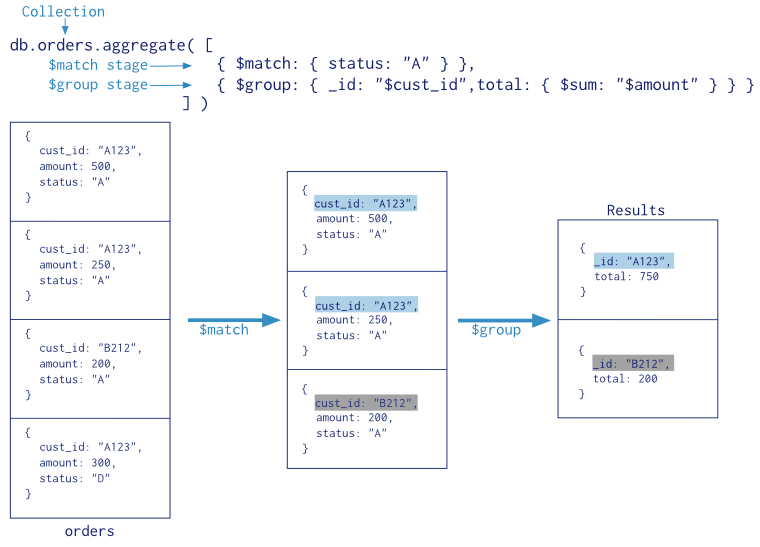

# Aggregation

Process data records and return computed results. Aggregation operations group values from multiple documents together, and can perform a variety of operations on the grouped data to return a single result. MongoDB provides three ways to perform aggregation: the aggregation pipeline, the map-reduce function, and single purpose aggregation methods.

## Aggregation Pipeline - aggregate()

Documents enter a multi-stage pipeline that transforms the documents into an aggregated result. The pipeline provides efficient data aggregation using native operations within MongoDB, and is the preferred method for data aggregation in MongoDB.

The aggregation pipeline can operate on a sharded collection.

The aggregation pipeline can use indexes to improve its performance during some of its stages. In addition, the aggregation pipeline has an internal optimization phase.

### Pipeline Concept

In UNIX command shell pipeline means the possibility to execute an operation on some input and use the output as the input for the next command and so on. MongoDB also support same concept in aggregation framework. There is a set of possible stages and each of those is taken a set of documents as an input and is producing a resulting set of documents (or the final resulting JSON document at the end of the pipeline). This can then in turn again be used for the next stage an so on.

## Map-Reduce - mapReduce()

MongoDB also provides map-reduce operations to perform aggregation. In general, map-reduce operations have two phases: a map stage that processes each document and emits one or more objects for each input document, and reduce phase that combines the output of the map operation. Optionally, map-reduce can have a finalize stage to make final modifications to the result.

Map-reduce uses custom JavaScript functions to perform the map and reduce operations, as well as the optional finalize operation. While the custom JavaScript provide great flexibility compared to the aggregation pipeline, in general, map-reduce is less efficient and more complex than the aggregation pipeline.

Map-reduce can operate on a sharded collection.

## Single Purpose Aggregation Operations

MongoDB also provides `count()`, `group()`, `distinct()` special purpose database commands.

All of these operations aggregate documents from a single collection.

While these operations provide simple access to common aggregation processes, they lack the flexibility and capabilities of the aggregation pipeline and map-reduce.

