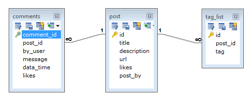

# Schema design

## Some considerations while designing schema in MongoDB

1. Combine objects (documents) in one collection if you will use them together. Otherwise separate them but make sure there should not be a need of joins.

2. When designing a data model, consider how applications will use your database. For instance, if your application only uses recently inserted documents, consider using Capped Collections. Or if your application needs are mainly read operations to a collection, adding indexes to support common queries can improve performance. Adding an index potentially increases query speed, but it reduces insertion or deletion speed. It's best to consider only adding indexes for collections where the number of reads is higher than the number of writes. When more writes occur than reads, indexes may even prove to be counter productive.

3. The rule of thumb when using MongoDB is to embed data (Embedded Object) means denormalize whenever you can. This approach is far more efficient and almost always viable.

4. Do joins while write, not on read. This increases the possibility of duplicate data but disk space is cheap as compare to compute time. Make sure the duplication is limited.

5. **Document fields (object keys) must be valid javascript variable name** means no special character or spaces in field name. Just include `[a-z][0-9]` and underscore `_`. This is because when you access the object key you can do it easily by dot notation for all keys. If you have spaces or special character then you have to use `[]` to access document key which is not recommended way. In order to be consistent in accessing document key by dot notation, name them properly.

```js
var obj = {
  'colOne': 'val one',
  'col two': val two'
};

obj.colOne; // valid
obj.'col two'; //not allowed

//the only way to access it is
obj['col two'];
```

**Example** - Blog's Post

**RDBMS Schema** - Normalized, each table has one purpose not mixed responsibilities. And they are connected by foreign key (relation key). More table join during read but reduce data redundancy.



**MongoDB Schema** - Denormalized, document has mixed responsibilities and no use of foreign key. Join during write but single query during read do the work. Also increase data redundancy.

```js
{
   _id: POST_ID
   title: TITLE_OF_POST,
   description: POST_DESCRIPTION,
   by: POST_BY,
   url: URL_OF_POST,
   tags: [TAG1, TAG2, TAG3],
   likes: TOTAL_LIKES,
   comments: [
      {
         user:'COMMENT_BY',
         message: TEXT,
         dateCreated: DATE_TIME,
         like: LIKES
      },
      {
         user:'COMMENT_BY',
         message: TEXT,
         dateCreated: DATE_TIME,
         like: LIKES
      }
   ]
}
```

In MongoDB the join is done during write so when reading data for post system has to read it from one collection which make it fast, on the other hand, in RDBMS, the system has to read the data from 3 tables by joining them which make it slow.
