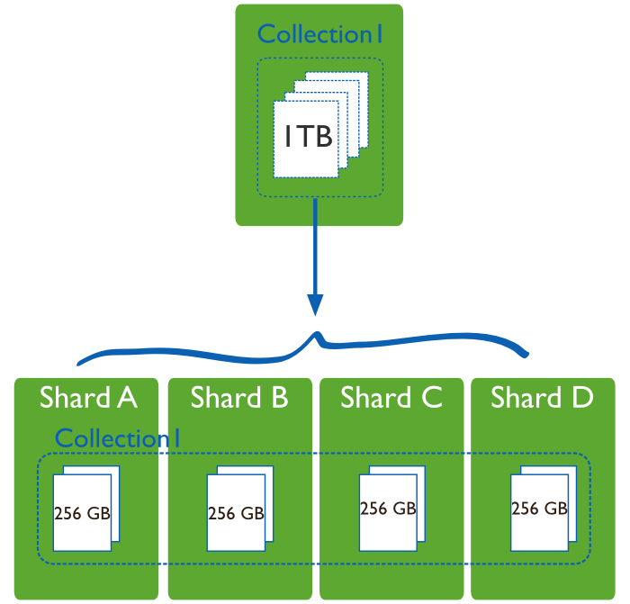

# Sharding

Sharding is a method for storing data chunks across multiple machines.

## Why Sharding?

Database systems with large data sets and high throughput (rate of production or the rate at which something can be processed) applications can challenge the capacity of a single server. High query rates can exhaust the CPU capacity of the server. Larger data sets exceed the storage capacity of a single machine. Finally, working set sizes larger than the system's RAM stress the I/O capacity of disk drives.

To address these issues of scales, database systems have two basic approaches:

**Vertical scaling** adds more CPU and storage resources to increase capacity. Scaling by adding capacity has limitations: high performance systems with large numbers of CPUs and large amount of RAM are disproportionately more expensive than smaller systems.

**Sharding, or horizontal scaling**, by contrast, divides the data set and distributes the data over multiple servers, or shards. Each shard is an independent database, and collectively, the shards make up a single logical database. Sharding reduces the number of operations each shard handles. Each shard processes fewer operations as the cluster grows. As a result, a cluster can increase capacity and throughput horizontally.

