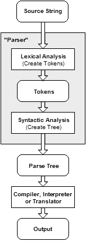

# Parser

A parser is a software component that takes input data (frequently text) and builds a data structure – often some kind of parse tree, abstract syntax tree or other hierarchical structure, giving a structural representation of the input while checking for correct syntax.



## Phases

### Lexical analysis

> Tokenizer - Scanner - Lexer
>
> Token - Lexeme

**Transforms a sequence of characters in a sequence of tokens**. This phase scans the source as a stream of characters and converts it into meaningful lexemes. The phase of lexical analysis is responsible for dividing the input string (or stream of characters) of the program into smaller pieces called tokens. The tokens usually carry information about their type (if they are numbers, operators, keywords, identifiers, etc), the substring of the program they represent and their position in the program. The position is usually used for reporting user friendly errors in case of invalid syntactical constructs.

**Lexer rules** - lexer can also have rules that can be used to identify and extract tokens from string.

```
// Lexer rules.
WORD: (LOWERCASE | UPPERCASE | '_')+ ;
WHITESPACE: (' ' | '\t') ;
NEWLINE: ('\r'? '\n' | '\r')+ ;
TEXT: ~[])]+ ;
```

```js
// Tokens might look something like this for syntax
// (add 2 (subtract 4 2))
[
  { type: 'paren',  value: '('        },
  { type: 'name',   value: 'add'      },
  { type: 'number', value: '2'        },
  { type: 'paren',  value: '('        },
  { type: 'name',   value: 'subtract' },
  { type: 'number', value: '4'        },
  { type: 'number', value: '2'        },
  { type: 'paren',  value: ')'        },
  { type: 'paren',  value: ')'        },
]
```

### Syntax analysis

> Parser

It takes the token produced by lexical analysis as input and generates a parse tree (or syntax tree). In this phase, token arrangements are checked against the source grammar, i.e. the parser checks if the expression made by the tokens is syntactically correct.

The syntax analyzer (often known as parser) is the module of a compiler which out of a list (or stream) of tokens produces an Abstract Syntax Tree (or in short an AST). Along the process, the syntax analyzer may also produce syntax errors in case of invalid programs.

```js
// Abstract Syntax Tree (AST) might look like this.
{
  type: 'Program',
  body: [{
    type: 'CallExpression',
    name: 'add',
    params: [{
      type: 'NumberLiteral',
      value: '2',
    }, {
      type: 'CallExpression',
      name: 'subtract',
      params: [{
        type: 'NumberLiteral',
        value: '4',
      }, {
        type: 'NumberLiteral',
        value: '2',
      }]
    }]
  }]
}
```

### Transformation

This takes the AST from the syntax analysis step and makes changes to it. It can manipulate the AST in the same language or it can translate it into an entirely new language.

When transforming the AST we can manipulate nodes by adding/removing/replacing properties, we can add new nodes, remove nodes, or we could leave the existing AST alone and create an entirely new one based on it.

### Generation

Code Generation takes the transformed representation of the code and turns it into new code. It can output code in multiple different forms.
