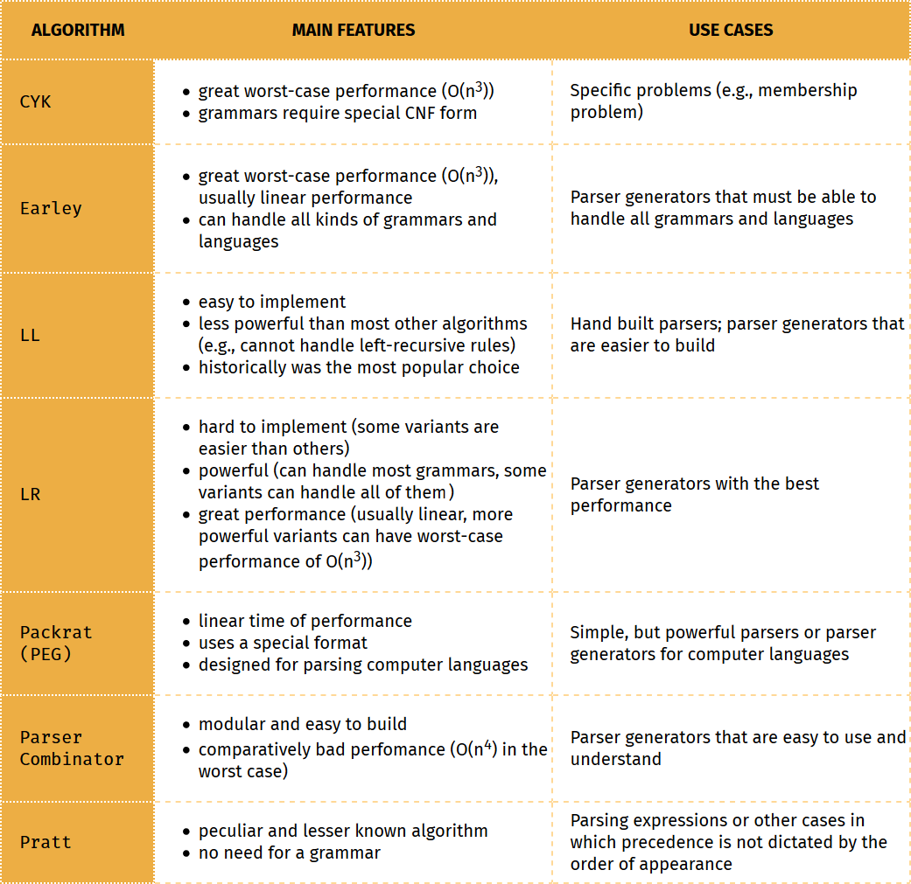

# Parsing algorithms

## Two strategies

### Top-down parsing

A top-down parser tries to identity the root of the parse tree first, then it moves down the subtrees, until it find the leaves of the tree.

> Traditionally top-down parsers are easier to build.

#### Top-down algorithms

##### LL parser

LL (**L**eft-to-right read of the input, **L**eftmost derivation) parsers are table-based parsers without backtracking, but with lookahead. Table-based means that they rely on a parsing table to decide which rule to apply. The parsing table use as rows and columns nonterminals and terminals, respectively.

To find the correct rule to apply:

1. firstly the parser look at the current token and the appropriate amount of lookahead tokens
2. then it tries to apply the different rules until it finds the correct match.

##### Earley parser

The Earley parser is a chart parser named after its inventor Jay Earley. The algorithm is usually compared to CYK, another chart parser, that is simpler, but also usually worse in performance and memory. The distinguishing feature of the Earley algorithm is that, in addition to storing partial results, it implement a prediction step to decide which rule is going to try to match next.

##### Packrat (PEG)

Packrat is often associated to the formal grammar PEG, since they were invented by the same person: Bryan Ford. Packrat was described first in his thesis: Packrat Parsing: a Practical Linear-Time Algorithm with Backtracking. The title says almost everything that we care about: it has a linear time of execution, also because it does not use backtracking.

The other reason for its efficiency it is memoization: the storing of partial results during the parsing process. The drawback, and the reason because the technique was not used until recently, is the quantity of memory it needs to store all the intermediate results. If the memory required exceed what is available, the algorithm loses its linear time of execution.

##### Recursive descent parser

A recursive descent parser is a parser that works with a set of (mutually) recursive procedures, usually one for each rule of the grammars. Thus the structure of the parser mirrors the structure of the grammar.

Recursive descent parser backtracks. That is to say one that find the rule that matches the input by trying each one of the rules in sequence, and then it goes back each time it fails.

Typically recursive descent parser have problems parsing `left-recursive` rules, because the algorithm would end up calling the same function again and again. A possible solution to this problem is using tail recursion. Parsers that use this method are called **tail recursive parsers**.

Tail recursion per se is simply recursion that happens at the end of the function. However tail recursion is employed in conjuction with transformations of the grammar rules. The combination of transforming the grammar rules and putting recursion at the end of the process allows to deal with left-recursive rules.

### Bottom-Up parsing

A bottom-up parses instead starts from the lowest part of the tree, the leaves, and rise up until it determines the root of the tree.

> bottom-up parsers are more powerful.

#### Bottom-up algorithms

The bottom-up strategy main success is the family of many different LR parsers. The reason of their relative unpopularity is because historically they have been harder to build, although LR parser are also more powerful than traditional LL grammars.

##### CYK parser

The Cocke-Younger-Kasami (CYK) it has been formulated independently by the three authors. Its notability is due to a great worst-case performance (O(n3)), although it is hampered by a comparatively bad performance in most common scenarios.

However the real disadvantage of the algorithm is that it requires the grammars to be expressed in the Chomsky normal form.

##### LR parser

LR (**L**eft-to-right read of the input, **R**ightmost derivation) parsers are bottom-up parsers that can handle deterministic context-free languages in linear time, with lookahead and without backtracking. The invention of LR parsers is credited to the renown Donald Knuth.

However LR grammars are less restrictive, and thus more powerful, than the corresponding LL grammars. For example, there is no need to exclude left-recursive rules.

## Comparison table

