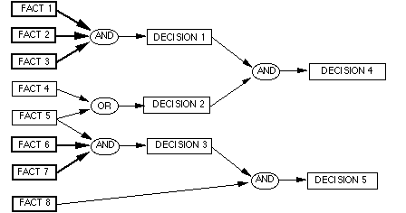

# Terminology

## Syntax versus Semantics

> Syntax = Form

> Semantics = Meaning

The sentence, “Colorless green ideas sleep furiously.” illustrates the difference between syntax and semantics: it is syntactically correct, because the grammar and punctuation are proper. But what does this sentence mean? How can ideas sleep? If ideas can sleep, what does it mean for them to sleep furiously? Can ideas have colors? Can ideas be both colorless and green? These questions all relate to the semantics, or meaning, of the sentence.

Two semantic issues are important in programming languages:

1. Can different symbols have the same meaning?
2. Can one symbol have different meanings?

The first issue is easy to illustrate; the symbols we analyze is a `name`. Everyone has a nickname;so two names (two symbols) can refer to the same person. The second issue is a bit more subtle; here the symbol we analyze is the phrase `next class` in a sentence. Suppose you take a course meeting Mondays, Wednesdays and Fridays. If your instructor says on Monday, “The next class is canceled.” you know not to come to class on Wednesday. Now suppose you take another course meeting every weekday. If your instructor for that course says on Monday, “The next class is canceled.” you know not to come to class on Tuesday. Finally, if it were Friday, “The next class is canceled.” has the same meaning in both courses: there is no class on Monday. So the meaning of a phrase (the symbol) in a sentence may depend on its context (what course you hear it in).

> Language grammar such as `EBNF` specify only syntax. That means grammar can only check the syntax validity. It cannot check the semantic or meaning.

There is another phase in parsing which is called **Semantic Analyze** where parser validate the semantic or meaning of syntax.

What does it mean? Consider these examples:

* A document containing multiple declarations of elements with the same name.
* A sum of two variables: an integer and a boolean.
* A reference to a variable that was not declared before.

We can imagine a language where all these examples are syntactically correct, i.e., they are built according to the grammar of the language. However, they are all semantically incorrect, because they do not respect additional constraints on how the language should be used. These semantics constraints are used in addition to the grammar after the structures of the language have been recognized. In the grammar, we can say things like a declaration should be composed by a certain keyword and a name, with semantic constraints we can say two declarations should not have the same name. By combining syntactic and semantic rules we can express what is valid in our language.

### How do you define semantic rules?

By writing code that works on the AST. You cannot do that in the grammar such as EBNF.

## Terminal vs Non-Terminal

Terminal symbol is one that cannot be broken down further.

Non-terminal symbol is a symbol that can be reduced further until it's reduced to a terminal symbol.

For instance, the following represents an integer (which may be signed) expressed in a variant of Backus–Naur form:

```
<digit> ::= '0' | '1' | '2' | '3' | '4' | '5' | '6' | '7' | '8' | '9'
<integer> ::= ['-'] <digit> {<digit>}
```

In this example, the symbols `(-,0,1,2,3,4,5,6,7,8,9)` are terminal symbols and `<digit>` and `<integer>` are nonterminal symbols.

## Production rule

> Just a **Rule**.

Grammar is substantially a list of production rules. Each production rule tells us how a non-terminal can be composed. It tells how the syntax can be formed one or more ways.

### How production rule is formed?

**left-hand side → right-hand side** - **LHS -> RHS**

```
S → AB
S → ε (where ε is the empty string)
A → aS
B → b
```

Nonterminals are often represented by uppercase letters, terminals by lowercase letters, and the start symbol by `S`. For example, the grammar with terminals `{a, b}`, nonterminals `{S, A, B}`, production rules.

### Rule evaluation

Rules can be evaluated by:

* Backward chaining.
* Forward chaining.

Example:

```
`if` patient has high levels of the enzyme ferritin in their blood
`and` patient has the Cys282→Tyr mutation in HFE gene
`then` conclude patient has haemochromatosis.
```

#### Backward chaining

To determine if a decision should be made, work backwards looking for justifications for the decision. Eventually, a decision must be justified by facts.


#### Forward chaining

Given some facts, work forward through inference net. Discovers what conclusions can be derived from data.



## Parsing tree and Abstract syntax tree

There are two terms that are related and sometimes they are used interchangeably: Parse Tree and Abstract Syntax Tree (AST). Technically the parse tree could also be called Concrete Syntax Tree (CST), because it should reflect more concretely the actual syntax of the input, at least compared to the AST.

Conceptually they are very similar. They are both trees: there is a root that has nodes representing the whole source code. The root have children nodes, that contains subtrees representing smaller and smaller portions of code, until single tokens (terminals) appears in the tree.

**The difference is in the level of abstraction:** a parse tree might contains all the tokens which appeared in the program and possibly a set of intermediate rules.  The AST instead is a polished version of the parse tree, in which only the information relevant to understanding the code is maintained.

For example: You parse string `10 plus 21`.


