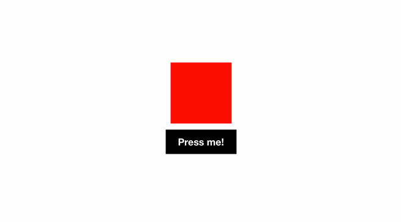

# Layout animation

**LayoutAnimation **comes with very simple and easy API, and allows us to animate transitions between layout changes. `LayoutAnimation`allows you to define mounting and update animations. They animate every property that changes in a component – usually by calling`setState`.

This is good option for when you want to apply the same animation for all properties or you don't know the specific values you are animating between. These are native animations and are mostly not affected by what is happening in JavaScript world during their execution. These animations are not taking place in the JavaScript world of React Native, so that means if there is another `setState`diff that is triggered during the animation you will be mostly unaffected.



```js
class App extends Component {
  constructor(props) {
    super(props);
    this.state = { s: 100 };
  }

  _onPress = () => {
    LayoutAnimation.spring(); // must be called before this.setState
    this.setState({ s: this.state.s + 15 });
  }

  render() {
    return (
      <View style={ styles.container }>
        <View style={[
          styles.box,
          { width: this.state.s, height: this.state.s }
        ]} />

        <TouchableOpacity onPress={ this._onPress }>
          <View style={ styles.button }>
            <Text style={ styles.buttonText }>Press me!</Text>
          </View>
        </TouchableOpacity>
      </View>
    );
  }
}

var styles = StyleSheet.create({
  container: {
    flex: 1,
    justifyContent: 'center',
    alignItems: 'center',
  },
  box: {
    backgroundColor: 'red',
  },
  button: {
    marginTop: 10,
    paddingVertical: 10,
    paddingHorizontal: 20,
    backgroundColor: 'black',
  },
  buttonText: {
    color: 'white',
    fontSize: 16,
    fontWeight: 'bold',
  },
});
```
