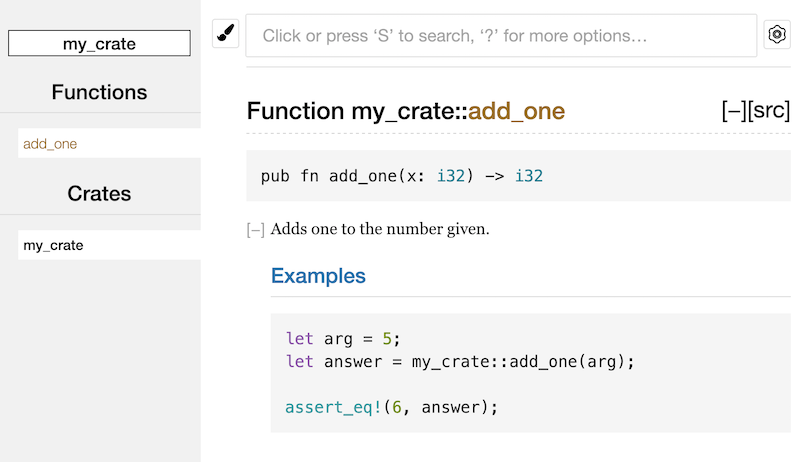

# Comments

## Code

```rs
// Single line

/**
* Block
*/
```

## Documentations [///]

> Doc comments - To produce documentation by running `cargo doc`.

Documentation comments use `///` instead of `//` and support Markdown notation for formatting the text if you’d like. You place documentation comments just before the item they are documenting.

> See how markdown is used.

```rs
/// Adds one to the number given.
///
/// # Examples
///
/// ```
/// let arg = 5;
/// let answer = my_crate::add_one(arg);
///
/// assert_eq!(6, answer);
/// ```
pub fn add_one(x: i32) -> i32 {
    x + 1
}
```

Here, we give a description of what the `add_one` function does, start a section with the heading `Examples`, and then provide code that demonstrates how to use the `add_one` function. We can generate the HTML documentation from this documentation comment by running `cargo doc`. This command runs the `rustdoc` tool distributed with Rust and puts the generated HTML documentation in the _target/doc_ directory.

For convenience, running `cargo doc --open` will build the HTML for your current crate’s documentation (as well as the documentation for all of your crate’s dependencies) and open the result in a web browser. Navigate to the `add_one` function and you’ll see how the text in the documentation comments is rendered, as shown:



### //!

Adds documentation to the item that contains the comments rather than adding documentation to the items following the comments. We typically use these doc comments inside the crate root file (src/lib.rs by convention) or inside a module to document the crate or the module as a whole.

> This is used when you want to tell about the crate or module as a whole.

```rs
//! # My Crate
//!
//! `my_crate` is a collection of utilities to make performing certain
//! calculations more convenient.

/// Adds one to the number given.
// --snip--
```


