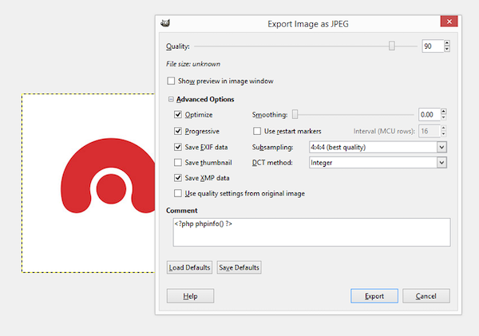

# File upload

## No validation

File uploaded to server can be accessed directly by using url. Therefore the files can be accessed using a URL such as `http://www.example.com/uploads/uploadedfile.txt.`

If no restrictions are imposed by the server-side script on what file types are allowed to be uploaded to the server. To such an extent, an attacker could easily upload a malicious PHP and execute it by accessing file in url `http://www.example.com/uploads/uploadedfile.php.`

> Whitelist the type of files that use can upload rather using blacklist approach.

### Using .htaccess

One possible way an attacker could bypass a file extension blacklist on an Apache HTTP Server, is to first upload an `.htaccess` file with the following contents.

```info
AddType application/x-httpd-php .jpg
```

The above configuration would instruct Apache HTTP Server to execute JPEG images as though they were PHP scripts. An attacker would then proceed to upload a file with a `.jpg` extension (a file extension that is presumably allowed), which would contain PHP code instead of an image.

### Bypass an image’s header

PHP’s `getimagesize()` is used at server side to validate image upload by looking into image header. If an attacker attempts to upload a PHP code embedded in a JPEG file, the function will return false, effectively stopping the attack. . If an image file is opened in an image editor, such as GIMP, one can edit the image’s metadata to include a comment. An attacker would insert some PHP code here as shown below.

The image will still have a valid header; therefore it bypasses the `getimagesize()` check.



## Prevention

- Define an `.htaccess` file that will only allow access to files with allowed extensions.
- Do not place the `.htaccess` file in the same directory where the uploaded files will be stored, instead, place it in the parent directory — this way the `.htaccess` file can never be overwritten by an attacker.
- Create a whitelist of accepted MIME-types.
- Generate a random file name and add the previously generated extension.
- The application should perform content checking on any files which are uploaded to the server. Files should be thoroughly scanned and validated before being made available to other users. If in doubt, the file should be discarded.
- Uploaded directory should not have any "execute" permission and all the script handlers should be removed from these directories.
- File uploaders should be only accessible to authenticated and authorised users if possible.
